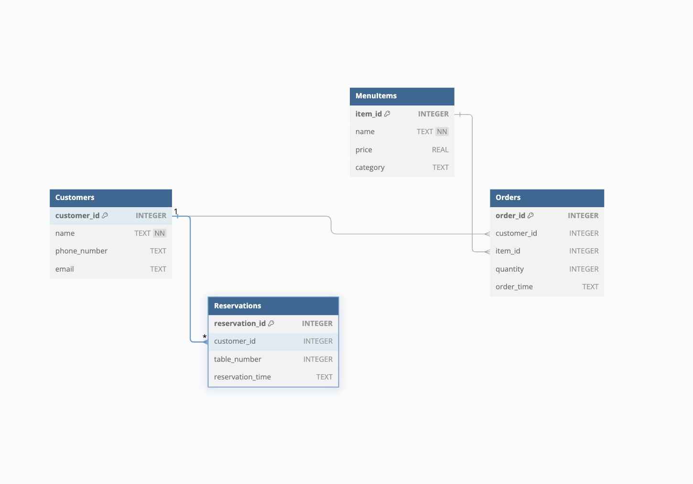

# Natural Language Query Project

## Database Description

This database is intended to model a restaurant's operations; I populated it with synthetic data. It consists of the following tables:

1. **Customers**
    - `customer_id` (INTEGER, PRIMARY KEY)
    - `name` (TEXT, NOT NULL)
    - `phone_number` (TEXT)
    - `email` (TEXT)

2. **Reservations**
    - `reservation_id` (INTEGER, PRIMARY KEY)
    - `customer_id` (INTEGER, FOREIGN KEY referencing Customers)
    - `table_number` (INTEGER)
    - `reservation_time` (TEXT)

3. **MenuItems**
    - `item_id` (INTEGER, PRIMARY KEY)
    - `name` (TEXT, NOT NULL)
    - `price` (REAL)
    - `category` (TEXT)

4. **Orders**
    - `order_id` (INTEGER, PRIMARY KEY)
    - `customer_id` (INTEGER, FOREIGN KEY referencing Customers)
    - `item_id` (INTEGER, FOREIGN KEY referencing MenuItems)
    - `quantity` (INTEGER)
    - `order_time` (TEXT)

## Sample Questions and Responses

### Example Questions That Worked Well

#### Question 1

**User Question**: *"How many orders did John Doe place?"*

**Generated SQL Query**:

```sql
SELECT COUNT(*) FROM Orders INNER JOIN Customers ON Orders.customer_id = Customers.customer_id WHERE Customers.name = 'John Doe'
```

**Friendly Response**:

"John Doe placed a total of 5 orders."

---

#### Question 2

**User Question**: *"How many orders have been placed?"*

**Generated SQL Query**:

```sql
SELECT COUNT(*) FROM Orders;
```

**Friendly Response**:

"A total of 10 orders have been placed."

---

### Example Questions That Did Not Work Well

#### Question 3

**User Question**: *"How many customers named john are there?"*

**Generated SQL Query**:

```sql
SELECT COUNT(*) FROM Customers WHERE name = 'john';
```

**Friendly Response**:

"It looks like there are currently no customers named John in the database. If you have any other questions or need assistance, feel free to ask!"

**Issue**: The query is case-sensitive and searching for exact matches. A fuzzy search query would have worked.

---

#### Question 4

**User Question**: *"How many customers with the name john are there?"*

**Generated SQL Query**:

```sql
SELECT COUNT(*) FROM Customers WHERE name = 'john';
```

**Friendly Response**:

"It looks like there are currently no customers with the name John in our database. If you have any other questions or need further assistance, feel free to ask!"

**Issue**: Same as above. I changed the language a bit to see if it'd help it write it as a fuzzy search but it didn't.

---

### Example Question Highlighting Limitations

#### Question 5

**User Question**: *"What is the most popular order?"*

**Generated SQL Query**:

```sql
SELECT item_id, SUM(quantity) AS total_quantity FROM Orders GROUP BY item_id ORDER BY total_quantity DESC LIMIT 1;
```

**Friendly Response**:

"The most popular order is for item ID 1, with a total quantity of 4! Let me know if you need more information."

**Issue**: The response refers to 'item ID 1'. This is pretty useless without a follow up question to figure out what an Item ID 1 is.

---

### Observations on Fuzzy Search

The AI model appears to struggle with case sensitivity as well as identifying what data is actually relevant to tell the end user.

## Different Prompting Strategies Tested

Initially, the prompt provided to the AI model included only the table names and column names. It was a zero shot attempt, and it still is.
However, I refined it to where it is forced to only return sql. Before that it was providing explanations and a whole bunch of other stuff that
was screwing up the query.

## Additional Examples

#### Question 6

**User Question**: *"How many reservations are there?"*

**Generated SQL Query**:

```sql
SELECT COUNT(*) FROM Reservations;
```

**Friendly Response**:

"There are 9 reservations."

---

#### Question 7

**User Question**: *"How many reservations are scheduled for today?"*

**Generated SQL Query**:

```sql
SELECT COUNT(*) FROM Reservations WHERE DATE(reservation_time) = DATE('now');
```

**Friendly Response**:

"There are 2 reservations scheduled for today."


## Conclusion

This project was honestly pretty fun. I think that given proper steering there really isn't limitations to what you could have
the LLM query for you. I say this with current limitations in mind. Different prompting strategies, and proper vectorization of the DB schema itself so the llm can find the proper path
would be key to this. In addition to that various tunings would be useful such as fuzzy searching and better responses would improve this as well.